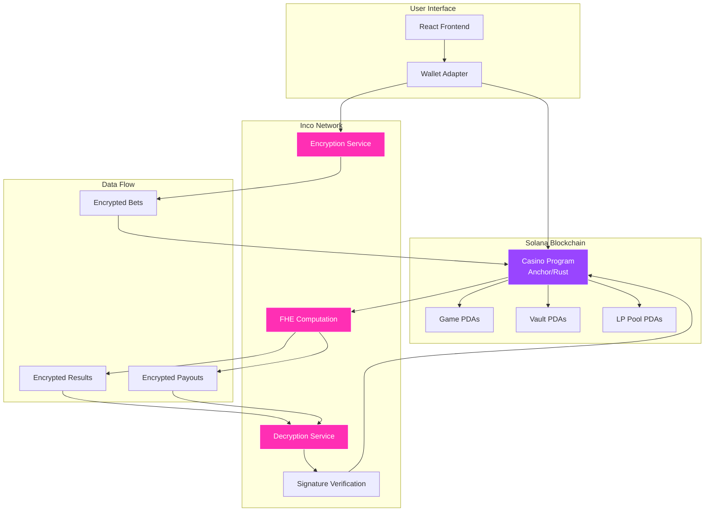
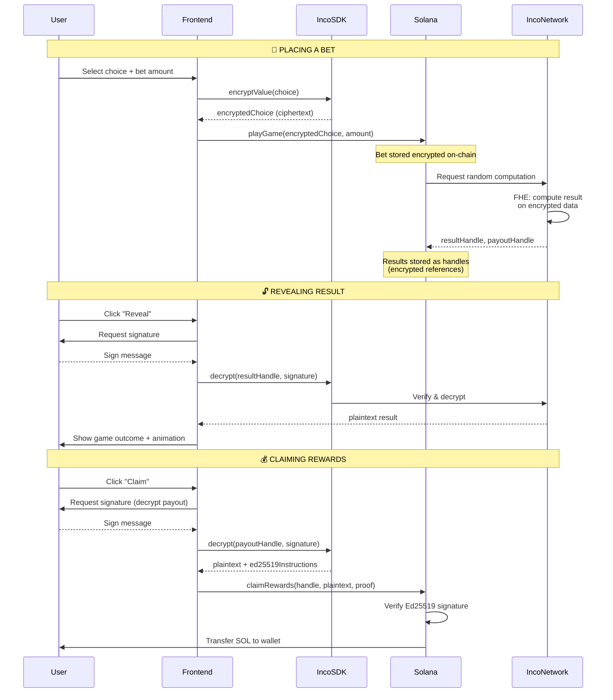
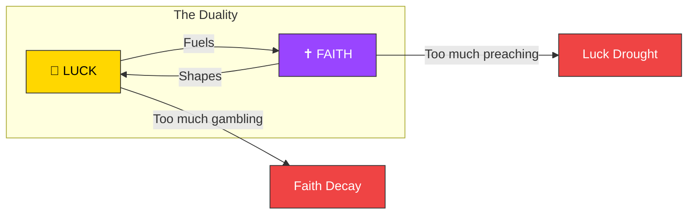
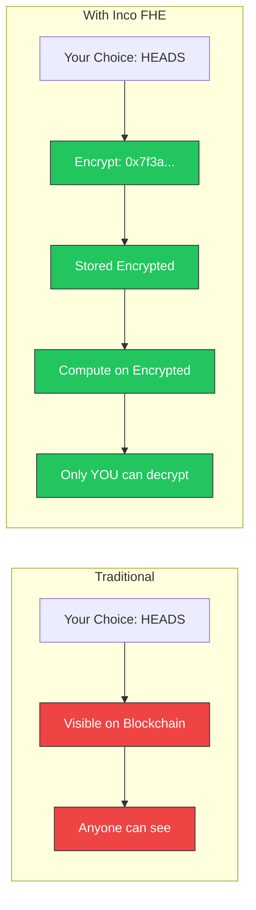

# 🎰⛪ The Casino and The Church

> *A narrative-driven game that captures the duality of crypto - speculation ad beleif.*

---

## 📖 The Backstory

> *Most believe crypto is one thing. They are wrong.*
>
> *It is two.*

On one side lies **The Casino** — flashing lights, spinning wheels, memecoin madness. Fortunes made, fortunes lost. A place where hope is pumped like oxygen, where laughter echoes alongside the sound of collapsing dreams. It is exhilarating, unpredictable, intoxicating.

On the other side stands **The Church** — a hall of sermons, prophecy, and belief. Here, old texts are rewritten as whitepapers. Here, the faithful argue over visions of tomorrow, promising freedom and salvation through code. It is solemn, righteous, inspiring.

**But here is the truth:**

```
The Casino funds the Church.
The Church built the Casino.
Neither can live without the other.
```

In this game, you are a wanderer between these realms.

- In **The Casino**, your **LUCK** will rise and fall as you play games of chance
- In **The Church**, your **FAITH** will grow through writing, quests, and prophecy

But beware—if you spend too long in one realm, the other will fade. Too much gambling, and your faith begins to crumble. Too much preaching, and your luck runs dry.

**Balance is survival.**

```
LUCK fuels FAITH.
FAITH shapes LUCK.
Together, they decide your fate.
```

Welcome to **The Casino and The Church**.

---

## 🏗️ Architecture

### System Overview



### Confidential Transaction Flow



---

## 🎮 Games & Features

### 🎰 The Casino Realm

| Game | Description | Privacy Level |
|------|-------------|---------------|
| **🪙 Coin Flip** | Heads or tails, encrypted choice | Full FHE |
| **🎰 Slot Machine** | 3-reel slots with encrypted outcomes | Full FHE |
| **🎡 Roulette** | Straight bets (0-36), encrypted number | Full FHE |
| **✈️ Aviator** | Cash out before crash, encrypted target | Full FHE |

**LUCK System:**
- Win games → LUCK increases
- Lose games → LUCK decreases
- High LUCK → Win Streak

### ⛪ The Church Realm

| Activity | Description | Reward |
|----------|-------------|--------|
| **📝 Write Sermons** | Create crypto-themed sermons | FAITH points |
| **🔮 Prophecy Quests** | Complete blockchain tasks | FAITH points |
| **🎁 Redemption** | Use FAITH for casino boosts | Free spins, odds boosts |

**FAITH System:**
- Complete quests → FAITH grows
- Neglect the Church → FAITH decays
- High FAITH → Boosts in the Casino
- Redeem FAITH → Play Casino games with FAITH points

### ⚖️ The Balance



---

## 🔒 Privacy Deep Dive

### How Inco Works



### What's Encrypted?

| Data | Encrypted? | Who Can Decrypt? |
|------|------------|------------------|
| Your bet choice | ✅ Yes | Only you |
| Game result | ✅ Yes | Only you |
| Payout amount | ✅ Yes | Only you |
| Bet amount (SOL) | ❌ No* | Public |
| Transaction signature | ❌ No | Public |

*\*Bet amounts are currently public. See [Roadmap](#roadmap) for confidential SPL tokens.*

## 🔐 What Makes This Different?

Traditional blockchain casinos have a fundamental problem: **everything is public**. Your bets, your choices, your wins, your losses — all visible on-chain for anyone to see. Front-runners can exploit your moves. Everyone knows your gambling history.

**The Casino and The Church** changes everything with **Inco Network's Fully Homomorphic Encryption (FHE)**:

| Traditional Casino | Confidential Casino |
|-------------------|---------------------|
| ❌ Bets visible on-chain | ✅ Bets encrypted |
| ❌ Choices exposed before reveal | ✅ Choices hidden until you decrypt |
| ❌ Results can be predicted | ✅ Results computed on encrypted data |
| ❌ Privacy violations | ✅ Only YOU can reveal YOUR data |
| ❌ Front-running possible | ✅ Cryptographically impossible to front-run |

---

### Security Guarantees

1. **No Front-Running**: Your encrypted choice cannot be read before the result is computed
2. **Provably Fair**: Results are computed using Inco's verifiable FHE
3. **Self-Sovereign**: Only YOUR signature can decrypt YOUR data
4. **On-Chain Verification**: Ed25519 signatures verify decryption validity

---

## 🛠️ Technical Stack

### On-Chain (Solana)

```
programs/
└── casino_n_church/
    └── src/
        ├── lib.rs                    # Program entry point
        ├── instructions/
        │   ├── admin.rs              # Vault initialization
        │   ├── casino_games/
        │   │   ├── play_coinflip.rs  # Encrypted coinflip
        │   │   ├── play_roulette.rs  # Encrypted roulette
        │   │   ├── play_slot.rs      # Encrypted slots
        │   │   ├── play_aviator.rs   # Encrypted aviator
        │   │   └── claim_rewards.rs  # Verified claim
        │   ├── church_quests/
        │   │   ├── writing_quest.rs  # Sermon writing
        │   │   └── blinks_quest.rs   # Blink quests
        │   └── liquidity_pool/
        │       ├── deposit.rs        # LP deposits
        │       └── withdraw.rs       # LP withdrawals
        ├── states/
        │   ├── casino.rs             # GameResult account
        │   ├── church.rs             # Quest accounts
        │   └── liquidity.rs          # LP accounts
        └── inco_helpers.rs           # FHE integration
```

### Off-Chain (Frontend)

```
app/client/
└── src/
    ├── components/
    │   ├── games/
    │   │   ├── CoinFlip.tsx          # Coinflip UI
    │   │   ├── Roulette.tsx          # Roulette UI
    │   │   ├── SlotMachine.tsx       # Slots UI
    │   │   ├── Aviator.tsx           # Aviator UI
    │   │   ├── ConfidentialRevealModal.tsx
    │   │   └── ClaimRewardsModal.tsx
    │   ├── CasinoRealm.tsx           # Casino hub
    │   └── ChurchRealm.tsx           # Church hub
    ├── hooks/
    │   ├── useCoinflip.ts            # Coinflip logic
    │   ├── useRoulette.ts            # Roulette logic
    │   ├── useSlotMachine.ts         # Slots logic
    │   ├── useAviator.ts             # Aviator logic
    │   └── useClaimRewards.ts        # Claim logic
    └── lib/
        └── program/
            ├── constants.ts          # PDAs, program ID
            └── inco.ts               # Inco SDK helpers
```

### Dependencies

| Package | Purpose |
|---------|---------|
| `@coral-xyz/anchor` | Solana program framework |
| `@solana/web3.js` | Solana JavaScript SDK |
| `@inco/solana-sdk` | FHE encryption/decryption |
| `@solana/wallet-adapter-react` | Wallet connection |
| `react` + `vite` | Frontend framework |

---

## 🚀 Getting Started

### Prerequisites

- Node.js 18+
- Rust 1.70+
- Solana CLI 1.17+
- Anchor CLI 0.29+

### Installation

```bash
# Clone the repository
git clone https://github.com/your-org/casino_n_church.git
cd casino_n_church

# Install dependencies
yarn install

# Build the program
anchor build

# Run tests
anchor test

# Deploy to devnet
anchor deploy --provider.cluster devnet
```

### Run the Frontend

```bash
cd app/client
yarn install
yarn dev
```

### Environment Variables

```env
VITE_RPC_URL=https://api.devnet.solana.com
VITE_PROGRAM_ID=F9wygaMhPNWmCd6MMtZg7orv6ZkvuF4ycWopZ9cjq3Nc
```

---

## 🗺️ Roadmap

### Phase 1: Foundation ✅
- [x] Encrypted coinflip, roulette, slots, aviator
- [x] Confidential reveal modal with storytelling UX
- [x] Two-step claim process (decrypt → claim)
- [x] On-chain signature verification

### Phase 2: The Church 🚧
- [ ] Sermon writing quests
- [ ] Blink integration for social quests
- [ ] LUCK ↔ FAITH balance mechanics
- [ ] Redemption system (FAITH → Casino boosts)

### Phase 3: Full Privacy 🔜
- [ ] **Confidential SPL Token** — Hide bet amounts
- [ ] Encrypted deposits/withdrawals
- [ ] 100% private transactions
- [ ] Zero-knowledge balance proofs

### Phase 4: Scale 📈
- [ ] Mainnet deployment
- [ ] iOS/Android mobile apps
- [ ] Cross-chain privacy bridge
- [ ] Governance token

---

## 🤝 Contributing

We welcome contributions! Please see our [Contributing Guide](CONTRIBUTING.md) for details.

```bash
# Fork the repo
# Create your feature branch
git checkout -b feature/amazing-feature

# Commit your changes
git commit -m 'Add amazing feature'

# Push to the branch
git push origin feature/amazing-feature

# Open a Pull Request
```

---

## 📜 License

This project is licensed under the MIT License - see the [LICENSE](LICENSE) file for details.

---

## 🙏 Acknowledgments

- [Inco Network](https://inco.org) — Confidential computing infrastructure
- [Solana Foundation](https://solana.com) — High-performance blockchain
- [Anchor](https://anchor-lang.com) — Solana development framework

---

<div align="center">

**Built with 🎲 LUCK and ✝️ FAITH**

*The Casino funds the Church. The Church built the Casino.*

[Website](https://playcnc.fun) • [Twitter](https://x.com/casino_n_church) • [Discord](#) • [Docs](#)

</div>
